# 叶嘉思楠兔叽的萌新小攻略1.10

## 目录

[一．前言](#一．前言)

[二．小萌新看这个](#二．小萌新看这个)

[三．老萌新看这个](#三．老萌新看这个)

[四．你离战胜合成屋只差这个](#四．你离战胜合成屋只差这个)

[五．想和他们一样强还需这个](#五．想和他们一样强还需这个)

[六．非常奇怪的小想法](#六．非常奇怪的小想法)

[七．通往明日的旅途](#七．通往明日的旅途)

[八．后记](#八．后记)

---

## 一．前言

2025 年 8 月 29  日。

作者是 4399 一服叶嘉思楠兔叽，qq2774254339。

很多小伙伴觉得小攻略的篇幅有些大。但是，不需要从头开始看啊！比如你想学 上卡就直接看第四部分，想学垫卡就直接看第五部分，谁让你看完了。

我的 b 站名：叶嘉思楠

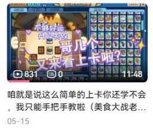

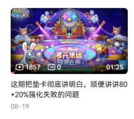

小攻略 1.10 版......为什么出了这么多版号呢？因为第一版小攻略是我两年前出的， 每版的主要内容都是差不多的，增加的只是一些细节。每当我急着把新想法告诉大家的时候，都会出一个新的小攻略文件。

---

## 二．小萌新看这个

### 1.qq 群号：美食大战老鼠大群 485400068 ，水天星河梦群 467607806

一服刚起步小公会萌食天堂招新， 目前六级公会六级合成屋，群号：538658351 叶嘉思楠自己的小群，需要交流的话可以来看看 529277902

### 2.给萌新玩家介绍一下这个游戏当前的一些武器和卡片。

①卡片（可以跳过，一年前写的，现在参考价值可能不太大了。可以直接看武器的推荐）（其实我都懒得修改了）

学会使用大群米鼠机器人搜索卡片。

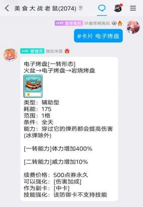

关于卡片，很多萌新玩家常忽略的一点就是卡片的技能，也叫熟练度，对卡片提 升很大，尤其棉花糖（减冷却）和小火炉（加火苗单值）等卡片的熟练度最为重要。刷熟练度的软件有水天星河梦的软件和律吕刷技能等。

**芥末海星刺身（炭烧海星二转）★★★★★：利用三岛 12 卡和威望可以快速把这张卡造出来。海星在巅峰对决中的表现极好，甚至比很多高配金卡更有机制上的针对性。**

**樱桃反弹布丁**★★★★★：一转后可以不需要咖啡粉。

**凉粉牛**★☆：冷却 10 秒。

**松塔爆破机★★★★（坚果爆炒机二转）：打玛门鼠等 boss 时不如海星。**

**冰块冷萃机**★★★★★（二转）：冷萃机可搭配莓果点心、精灵龙、四转宴飨女神，推荐二转莓果点心。推荐搭配：用海星在前排清兵，让冷萃机的子弹能打到 boss。

**糖葫芦炮弹**★★★★：**大多数地图有冷萃机就不需要糖葫芦了。不转防空喵伤害接近二转糖葫芦，有需要可以交易场买一个。

**小火炉**★★★★★：如果开局的小火炉不慎失去了，可以通过魔塔蛋糕秘宝窟刷新出并获得。如果没有产火武器，小火炉一定是必备的，不然花火龙开局放不出来。

**极寒冰沙**★★★★★**幻幻鸡**★★★★★：两者一起使用效果更好。

**梦幻多拿滋**★★★：萌新前期的最强真神，个人认为海星造出来之后可弃。当然，它有一定的防空作用，不过通常是爱心便当比较贵的时候用多拿滋平替。

**爱心便当**★★★★☆：在交易场购买。

以前爱心便当是不能打电流鼠的，但现在优化了这一点，这使得它很可能成为巅峰对决等关卡的一张优秀的对策卡。

**火箭猪**★★★★☆：本体和技能书交易场购买，转职凭证在周氪，推荐选择火箭猪和香料虎一起出现的周氪。

**星星兔**★★★★☆：二转启用。**守护神里格**★★★★☆：终转启用。

**战神阿瑞斯**★★★☆、**爱神丘比特**★★☆：三转配合转运能分解很多神谕之石。 **烤蜥蜴投手**★★★★、**振金投弹猪**★★★★、**全能糖球投手**★★★★。

在大多数地图，糖球投手的表现是优于烤蜥蜴的，但它的子弹容易被后排召唤物吸引。

**雷神索尔**（三转★★★★☆ , 高配★★★★) ：只适合通过周氪获取三转雷神， 仍然接近中氪性价比之王。

**能量喵**★★★★☆ , 冷却7 秒。

**猪猪加强器**要不要进化成欧若拉呢？氪不了欧若拉技能和转职的话，氪个高技能黑猪也是很不错的，没必要进化。

**窃蛋龙**★★★、**巨神尤弥尔（终转★★★★☆)** ：窃蛋龙推荐生肖宝珠兑换。 **主神奥丁**★★★★☆：直线射击卡，有穿透。

**火神洛基**：不转★★★☆ , 三转★★★★★ 。我觉得不转火神能用能量喵代替。 **大地女神盖亚**★★★★：终转启用，技能还需要很高的氪度。我觉得同氪度应该 有不少比它强的金卡了。

**赤帝祝融**★★★★：终转启用。**冰神典伊**★★★★：终转启用。

**冰晶龙**★★★★☆：强度比火箭猪高，但价格可能也更高。

**查克拉兔**★★★★☆：带穿透的海星。

**花火龙**：★★★★★生肖宝珠兑换，产火极高，冷却只有 7 秒。没必要转职，因 为有可能几万元扔转转里都不出花火龙二转，而且不转的产火已经够用了。

**10** **周年烟花**★★★★★、**微波炉爆弹**★★★★、**金牛烟花**★★★★★、 **逗猫棒**★★★★★

**瓜皮类**：只推荐带反伤效果的。一转瓜皮护罩★★★★☆ , 技能书便宜，练满了 冷却很快。处女座★★★★☆ , 想要的时候得不到，不想要的时候随便开箱子都 能开出两三个来。赫拉神使★★★★★ , 略强于二转处女座。

其他好用的辅助：**麦芽糖**★★★★★**深水炸弹**★★★★★ **油灯**★★★★★**9** **周年幸运草扇**★★★★★

**终转宙斯**★★★★☆目前几乎最强的数值怪，价格比别的终转金卡又高了一截。 **导弹蛇**★★★★☆几乎要二转 16 星才算得上好用，但是如果你的号上只有这样一张强卡，它也会有局限性，有的 boss 打不了。

新出的卡片，例如法师蛇、幻影蛇，因为我淡游太久，就没有去了解。

②主武器：可以看出评分都不算高，所以不是主要氪金方向。

星星枪★★★★☆, 可以不带宝石，也可以搭配星光宝石（日氪星能碎片兑换获得）。

猫猫枪★☆, 带上猫猫枪，会出现老鼠无法选中的 bug ，延缓过关时间。

月光流星枪★★★★, 追踪武器，功能有点类似海神镖枪，但不能对空。

海神镖枪★★★☆->宙斯神弩★★★☆->星之神杖★★★★☆, 星之神杖在魔塔顶层的表现还可以，配合冥王战镰等更佳。当然，我不确定这么高氪度的玩家是 否还需要这样一个辅助武器。其他的并不算实用。

冰勺弩枪★★★☆、冰霜连弩★★★★, 冰霜连弩是产火最多的主武器，获取途 径可关注贵宾俱乐部。

③副武器：

奥利奥盾牌★★★★★。

诸神之盾★★★★->主宰之盾★★★★☆->荆棘玫瑰★★★★☆, 这些盾主要用来增加卡片攻击力和产火，三种盾的价格可能都很贵，个人觉得主宰之盾性价比最高。

④超级武器：

榴弹炮★★★★：没什么用，但微氪党就保持这件初始武器就好。需要注意的是 不要给榴弹炮上宝石。

加强榴弹炮★★★★☆：搭配疾风宝石、转化宝石，产火能力最强的武器。加强 榴弹炮第一次释放的火正好够用来放第一个花火龙。缺点是在魔塔顶层不能用。

死神镰刀★★★☆->冥王战镰★★★★★->阿拉丁神灯★★★★☆, 我最推荐冥 王战镰，魔塔最高层的神器。

许愿精灵○（0 分），好看吗，电脑死机换的。

### 3.利用米鼠机器人获取往期周氪进行比较，周氪一定要理智，谨防老鼠背刺。

  

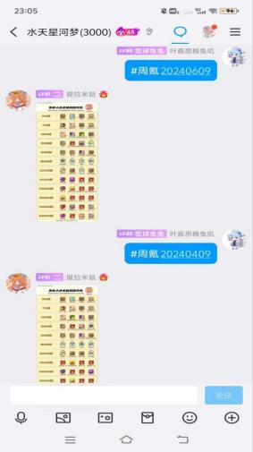

微氪玩家不要随意氪星级。先拿三岛 12 卡、11 卡，平时可以日氪一元攒假期票， 一定要氪的话就花钱买假期票换 12 卡。其他的途径实际的花销其实是很大的， 对巨氪还可以接受，因为他们要上 16 卡之类的，而微氪适合慢慢积累。

---

## 三．老萌新看这个

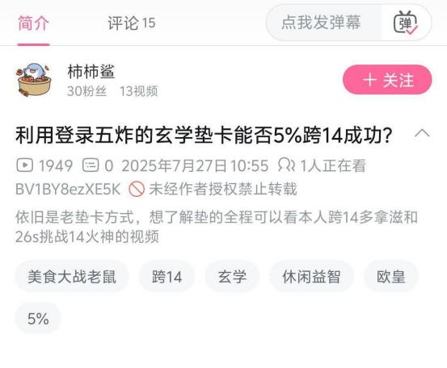

我想问这种人，你就确定你发现什么规律了吗，如果是幻觉，害人了怎么办？ 我 b 站视频里已经锐评过了。

  

### 1.又一个新的小玩法（前半部分数学预警，建议跳过）

如果你不光是个玩家，还是个研究者——

在此之前，问下大家：是否觉得跟合成屋谈数学期望没有意义，因为合成屋的概 率并不是真的？...有这想法就对了，因为这跟我们日常经验完全吻合。

但是，如果真是这样，会把一些原本很容易解释的事情都给搞复杂。

那这个问题我们过会再细聊。这要是三两句话能讲清楚，我们不会过了十四年还 在艰难研究上卡。大家先默认接受：数学期望对这个游戏很重要。后面再讨论它 到底重不重要。

然后，国产 AI 问答软件已经有至少六七种了吧？我用的有豆包、通义、deepseek， 我们要是有纯数学的问题可以用它们当计算器。

简单科普。上卡概率 53% ，结果 10000 次成功了 6000 次，这是小概率事件吗？ 最简单的就是用二项分布，小学时候我们就初步学了（硬币抛两次/多次），但 你要这么算的话会发现不论成多少次它都是小概率事件，比如 10000 次刚好不多 不少成功 5300 次，概率为 0.76% ，要是 6000 次只会比这个更低。高中时候我们 又学到卡方检验。它就适合用来检测小概率事件。

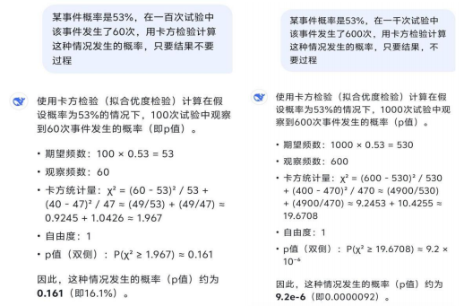

我说了不要过程，deepseek 就是不听话。

“小概率事件”定义不唯一，有时用 5% ，有时要用 1% 。上图 100 次试验对应 16.1% ，1000 次试验对应 92/1 千万。所以云涛晓雾用软件试验的 10000 次（见下文）简直是太靠谱了。其他一些问题只要你能讲清楚逻辑也能问 AI。

### 2.重新认识合成屋

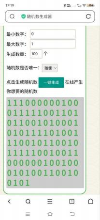

这是随机数生成器。

  

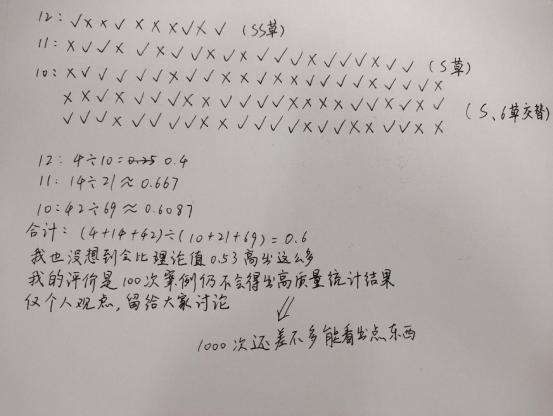

这是我统计的 100 次上卡数据。我的 B 站名：叶嘉思楠，上卡视频在我 b 站里。让我说对了吧，刚用卡方算过，才 100 次出点误差太正常了。

b 站 up 云涛晓雾在视频里说，合成屋很像真随机。对此我的看法完全一致。

合成屋有可能是个非常简单的小程序，不要被合成屋“玩弄”。

有人说高星卡容易炸。我不认可，我觉得高星和低星同概率没区别。

大家有时候会纠结于真随机和伪随机的问题。在这里**简单科普**。验证是否真随机 的数学方法有卡方检验和游程检验，感兴趣可以百度一下。C 语言 rand()函数实现成本小，可能通过卡方检验，却可能无法通过游程检验。一些复杂程序可能通过游程检验，实现非常高质量的随机，但一旦“种子”泄露有可能被预测程序行 为。绝对真随机在一些复杂科研实验中需要用到，实现成本较高、过程较长。

  

简单说就是越随机需要的成本就越高。实现绝对真随机并不能让上卡更幸运 if you trust me 。你要做的是多关注生活中的美好，忘记不开心的事。

到这你应该已经理解了真伪随机。但是肯定还有小伙伴觉得合成屋这个成炸分布也太离谱了。那么可以去 b 站搜一下这样两个视频。

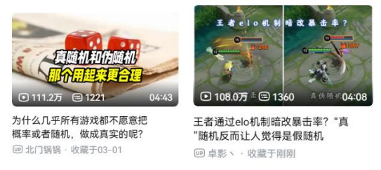

其实......

### 3.当你不够好运的时候，希望下面这段话能帮到你。

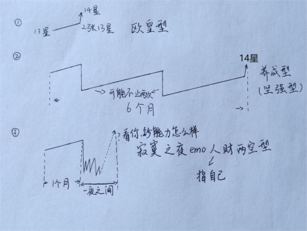

  

这图的意思就是，作为一个成熟的玩家，不要做第三种类型。玩老鼠是个持久战， 过程可能比你想象的还要长。

玩老鼠往往避免不了会有一些时段比较痛苦。我的建议是这时候可以玩玩别的游戏，分散一下注意力。如果只玩老鼠一个游戏的话，6 个月显得太漫长，炸卡的晚上也太抑郁。玩别的就可以暂时把老鼠的失利忘掉。

等你养成成功，再回望之前的这段经历，你会发现它也不过如此，会发现它痛苦但值得，会发现这个游戏你真正的会玩了。

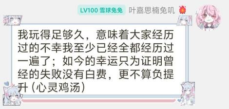

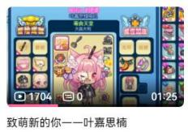

[我的 b 站视频](https://www.bilibili.com/video/BV1mUbGzuE3J/)

---

## 四．你离战胜合成屋只差这个

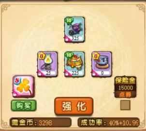

这“一大两小”的定式在我看来算是常识，就算搞玄学，如果不知道这个点，都很可能“捡了小的，丢了大的”。

为什么副卡组合比玄学还重要？第五部分我们慢慢聊。现在我们先默认接受这样一个事实：上卡的路径（也就是副卡的组合）对养成极为重要。上卡是否成功取 决于很多因素，但对长期来说路径甚至比运气还重要。很多老玩家都持这个观点。

### 1.加号概率详解

当合成屋显示 40+10%时，实际概率为 50% 。合成屋里给出的说明是 40%强化一次，若失败则 10%再强化一次。但是，例如用 80+20%试验，如果是官方给的说明，80%+0.2×20%=84%，那么 10000 次强化应该失败 1600 次左右，实际上可 能一次都不会失败。

再例如 40+10% ，理论上 40%+0.6×10%=46% ，也就是 10000 次成功 4600 次，但 用软件测一下会发现实际成功的数字接近 5000 次。

有人说遇到 80+20%失败的情况了。但每万次也只有极少的失败，距离理论的 1600 次还是差得远，所以无论如何官方的解释都应该是错的。但为什么他们遇到失败了呢？100%怎么会失败呢？

我在 b 站视频里有讲到。先默认它是直接相加的基础上存在少量 bug。那么由此得出结论，公会合成屋等级和 vip 等级带来的加成无疑是对上卡影响最大的一个因素。避免 bug 也很简单，就是倒上加 2 草，还不保险就加 3 草，如果还是没成就是恶性 bug 了，需要喊话官方，不修我们只好退游。

### 2.上卡路径（数学期望最优解）

**低星卡方案（通用）：**

- 主 3 ，副 1 或 2 ，不加草
- 主 4 ，副 3+1 草
- 主 5 ，副 4+2 草
- 主 6 ，副 5+3 草/副 5+4+3 草
- 主 7 ，副 6+4 草/副 6+5+4 草
- 主 8 ，副 8+5 草/副 8+6+5 草

每个人的四叶草丰度也不一样。假如你四叶草很充足，那么最节约的方式是不带小卡。我习惯开背包里多余的 4、5、6 星卡包作为小卡，反正本来就很难利用上。 没这些卡包我就选择不带小卡。

主 7 为什么副 6 而不是副7？

| 目标星级  (n+1) | 主卡星级  (n) | n      | n-1   | n-2   |
| :------------- | :----------- | :----- | :---- | :---- |
| 1              | 0            | 100.00 | 88.00 | -     |
| 2              | 1            | 100.00 | 88.00 | -     |
| 3              | 2            | 96.83  | 79.20 | 60.83 |
| 4              | 3            | 68.58  | 55.00 | 42.92 |
| 5              | 4            | 49.50  | 40.33 | 24.17 |
| 6              | 5            | 39.58  | 33.00 | 20.08 |
| 7              | 6            | 31.92  | 26.40 | 13.20 |
| 8              | 7            | 26.42  | 21.20 | 10.60 |
| 9              | 8            | 22.00  | 13.20 | 6.00  |
| 10             | 9            | 13.50  | 4.50  | 2.20  |
| 11             | 10           | 12.50  | 4.60  | 1.80  |
| 12             | 11           | 11.60  | 4.30  | 1.70  |
| 13             | 12           | 10.70  | 3.98  | 1.56  |
| 14             | 13           | 10.10  | 3.67  | 1.41  |
| 15             | 14           | 9.50   | 3.36  | 1.26  |

**由表格中能看出8星以下正上和跨卡相差不大，不建议正上。

9 星及以上上卡方案是大家熟悉的一大两小定式。至于是否要保险，那得根据个人的氪度来判断，你算一下你的高星卡值多少钱，是否值得带保险。比如白嫖党， 每张 14 都没花多少钱，那上 15 不带保险当然没问题，但是巨氪玩家快速氪出来 的 14 卡肯定不便宜，不能也不带保险。

**微氪玩家方案：**

- 主 9 ，副 9+7+7+6 草，或 9+5 草
- 主 10 ，副 10+8+8+S/SS 草
- 主 11 ，副 11+9+9+SS/SSS 草
- 主 12 ，副 12+10+10+SSS/SSR 草
- 主 13 ，副 13+11+11+SSR 草
- 主 14 ，副 14+12+12+SSR 草

活动送的免费 SSR 当然可以用来上 13 了，因为很多小伙伴根本没有上14的计划， 让 SSR 闲置在仓库也没啥意义。

**中氪玩家方案：**

- 主 13 ，副 13+11+11+SSR ，一般不保险，但还是看你是否需要冲消费额度等因素
- 主 14 ，副 14+蛇草+保险
- 主 15 ，副 15+蛇草+保险

**高氪玩家方案：**

- 主 9 ，副 9+7+7+6 草
- 主 10 ，副 10+8+8+S 草
- 主 11 ，副 11+9+9+SS 草
- 主 12 ，副 12+10+10+SSS/SSR 草
- 主 13 ，副 13+SSR+保险
- 主 14 ，副 14+蛇草+保险
- 主 15 ，副 14+蛇草+保险（跨）

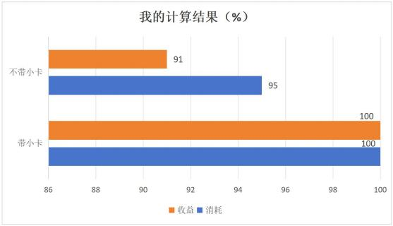

如果把带小卡作为标准（100%），会发现不带小卡收益少，也就是我常说的效率低，不节约。当然你也可以用自己的方式去算一算两种上卡方式的效率。并且用50%或者高一点的概率对心态真的友好得多。

有时候确实不太好接受，上 14 需要 11 星小卡，这花销也太大了吧？但这样想就 忽略了 13 卡本身的价值有多大，是 11 卡的多少倍，你用多少 11 卡能堆出个 13 卡。

平时 11 卡包留几个以备不时之需嘛，这样上 14 就有小卡用了。如果要上的时候 没 11 卡了，现做估计也来不及，那就缓半个月，也许就有小卡可以用了。上 14 卡这么重大的事情，就不应该非今天做不可。准备一段时间真的值得。

有读者会这样问：我带小卡不一定会成啊，不带不一定会炸啊。那么我们到第六 部分详细聊聊这个问题。

### 3.用大群提拉米鼠机器人查询某张卡的品质好中差

在大群中发送`#卡片 老鼠夹子` 口令可以得知其为差卡，再次发送`#卡片 多用老鼠夹子`  口令可以得知老鼠夹子转职后变为好卡。

这里我给出自己的理解（每张卡的价值）：

**主卡>好卡（副卡）>中卡>差卡

不光价值相差很大，而且各自升一星带来的价值提升也是不同的。

不要给中差卡上到很高的星。比如你有 11 星主卡、好卡、差卡各一张，先给差卡上 12 再倒给主卡，心态上似乎很舒适，但肯定是亏的，不妨换种想法，肯定 有别的既舒适又节约的上卡方式。

你可能觉得，某张卡上 12 连着失败好几次，这就是毒卡。然后就想上个 12 差卡 去给它倒。不过我不觉得有毒卡这回事。你可以去问问老玩家，当运气差的时候， 换什么卡它都炸。

### 4.不同品质卡片价值对比

一张 11 好卡的价值大约是 10 好卡的 4.3 倍。那么 11 差卡距离 11 好卡差一张10 卡和一次倒上，那么 11 差卡可以认为是 10 好卡的 3.3 倍。同理 10 差卡也大约是 9 好卡的 3.3 倍。你也可以用自己的方法去算一下倍数关系。

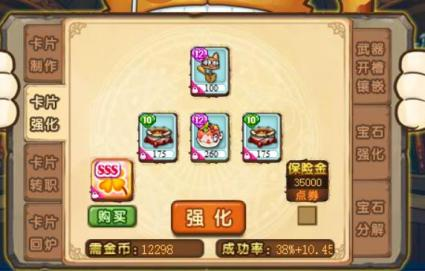

小攻略 1.9 里我说中卡推荐倒上，但后来我觉得中卡正上似乎更好，概率没有比好卡低太多。也就是说正上的效率比倒上高一些。但想倒上也绝对没问题，两者 的差距不大，而且倒上很稳，游戏体验很好。

差卡就绝不推荐正上了，只能倒上。

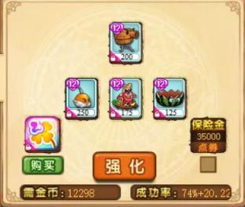

这种也不推荐。这个效率比正常上卡低得多，我 vip 等级高的情况下它才有个不错的概率。再说，正常上 13 也不算难上。很多人觉得 94%失败是系统问题，其 实单纯是太非了而已。

有很多玩家，上卡不是太冒险就是太奢侈。有时，把两种错误的做法取个平均刚 好就是最正确的做法，但很多人永远也找不到。

尽人事，听天命，成与不成没有人能控制。垫卡大神许你必成，如果没成就是你 没垫好，没把他的方法学到位，他这就是诈骗。

但亏与不亏，值与不值，节约与不节约，合适与不合适，这些你都能把握，你都 不难找到答案。也许你会低估“数学期望 ”这件事的重要性，但越来越多的玩家 已经察觉到了，它很重要。

---

## 五．想和他们一样强还需这个

你经常跟大神学习垫卡，想像他们一样强？包在我身上，我帮你实现你的愿望， 不用再劳神苦思垫卡失败究竟是比大神差在哪啦！

（垫卡一事可能并不存在，可能根本没有作用。很多人一开始坚定地认为垫卡无 用，也许本来就是对的，但耐不住身边十几个小伙伴都忽悠他，他也就相信了。）

垫卡的概念是 2020 年初才传播开的。这个视频虽然不是最早的垫卡，但它使得垫卡学说第一次普及到了全体玩家的范围。

与此同时诞生了垫卡的反义词：莽。不用说，在当时那个年代，垫卡是褒义词， 莽是贬义词。**但垫卡被过度神化并不是浅酌的责任**，他的教学视频里都没有把垫 卡失败的画面去掉，而是展示给观众，以示他的垫卡并不能做到 100%。

浅酌的方法还比较朴素，后来的大神的方法就越来越花里胡哨了。因为这样的播放量更多。如果是 4%概率跨卡时的垫卡，播放量、涨粉量更是翻倍。当然我说的是之前，现在大家已经知道这有多哗众取宠了。

直到 2023 年底，随着 b 站 up 云涛晓雾的这个视频发布，“上卡必须垫卡 ”的禁忌诅咒几乎是一夜之间一扫而空。

[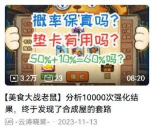](https://www.bilibili.com/video/BV1NH4y1q7Kw)

严谨的角度我们设想另一个可能。有可能 10000 次趋于标准概率，但是少量次数 就有问题，比如有操控，或者实现方法很诡异，导致分布不合理。但你要知道用 计算机最容易实现的正是随机数，以上的设想只会徒增工作量。

而且老鼠的系统本来就老旧，不流畅，额外的操作有可能更负担不起。那么像生 肖转转那样的概率造假有没有可能呢？仍然不太可能，因为合成屋的造假就不像 转转那样能带来实在的利益。老鼠应该也不希望在这种它挣不到多少钱的地方造 成玩家大量退游吧，那就亏大了。当然，别的理由也有，结尾再详细说。

不垫卡直接上卡曾经有一个侮辱性的名字：“莽 ”。在这里，我给出新的定义， 垫卡的反义词叫正常上卡，不叫莽。

这些是我以前用过，但现在已经不用的方法。

1.  主观感受某些区聚集了几十页人之后，在这些区上卡会更容易炸。

2.  用接近的概率垫上十几次，看看成炸分布是否均匀，如果成炸分布合理则直 接上卡，如果成炸分布不合理则刷新重进游戏继续垫，看看成炸是否合理。

3.  另一种更省事的方法：刷新游戏后直接上卡。你看别的垫卡人，垫得不理想 的时候，重进下游戏再接着垫，重启电脑的也有，都是一个道理。

垫卡无用的第二个证据：如果所谓“连炸区间 ”其实并不存在，那么垫卡的意义是什么呢？当然我们可以假设连炸区间存在，但你可以多试几次，看垫卡真能避 开连炸区间吗？真的避开了吗？

那些所谓的成就，其实不垫卡也能遇到。

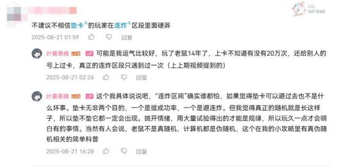

再解释一下，我没有不让大家垫卡，它肯定是没什么坏处的，甚至你让我跟你讲 讲花里胡哨的玄学我也会讲，我能设计出一种“很像那么回事 ”的垫法。但还是 那句话，它唯一的作用是带来情绪价值。我朋友喜欢一种叫“骗保 ”的玩法，我 也很支持，毕竟就算没收益，视觉效果还是有的。

视频文案：“我直说了垫卡无用。并不需要什么证据。所有玩家里到目前为止没 有出现任何一个真正会垫卡的人，已经很说明问题了。 ”

“什么？你说你会垫卡？那你就把工作辞了，靠接代上卡的单子也能致富。你说你没把握？那你倒是证明了我的说法。”（不稳你垫了个寂寞吗？）（其实这种力量并不属于你）

---

## 六．非常奇怪的小想法

因为是奇怪的小想法嘛，所以这里面的说法如果有错误，大家也别较真哦！我只 会把没什么实际作用但又想跟大家聊的话题放在这部分。

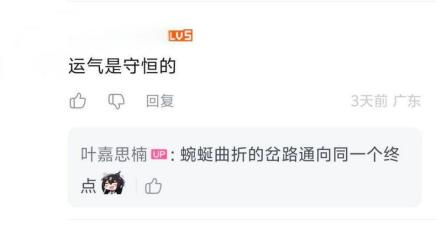

### 1.运气当然不守恒，不然问题就简单了。事实是，已经赚的都已经进了口袋， 已经亏的也都只能认栽，因为现在你又要面对一个新的开始了。

但长期来说，你说它守恒，好像也有点道理。你会发现连成和连炸都只是概率期 望的一小部分，似乎都预算在内了，次数够多的话每个人都得到一个差不多的结 果。

这些是我乱说的，也不知道对不对，大家参考就行，反正我自己玩这么久是这样。

### 2.大家听说过薛定谔的猫吧？（当然不是一回事，但借此打个比方）

假如你只有两张 14 卡，于是融掉其中一张，给另一张上 15 ，概率是 50%。

就像薛定谔的猫的状态既不是死也不是活（既死又活的叠加态）。当结果出来的 一刻到来，它瞬间从 50%成与50%炸的叠加态随机坍缩为成和炸中的一种基态。

所以结果出来之前，你就当它是平均状态，你看值不值。在这种决定之前一定要 考虑好这种代价。我总劝大家对上 15 不要有那么强的执念，对微微氪来说上 15 是一种很接近毁号的做法。

但正常上卡没有上头一说，它是一次尝试，是一次很宝贵的机会，能有这种机会 去试，不论成炸，对成功来说，它都有它的意义。

### 3.很多人喜欢说“成了就不亏”，但在我看来，你如果有这种想法，并总是做趋向亏本的事，一段时间过后你的号一定比别人短一截。

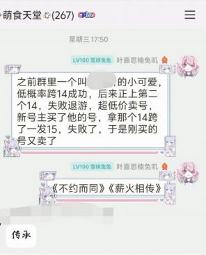

很多人喜欢说“米苏的挽留 ”。前面我说过，合成屋是个简单的小程序，所谓挽 留只是玩家的一厢情愿。萌新不要被老登忽悠了，不要把希望寄予最后这一次。

当然，有时候“米苏的挽留 ”不失为一种浪漫，但当有人用**跨卡**的方式“胁迫 ” 米苏挽留你，一旦侥幸成功被“挽留 ”还发表了自己的心得，忽悠萌新，这种人  真让人反感。

好在米苏是没有思想的机器，不然她看到你的“赌瘾 ”，只会对你更放心。“你 倒是退啊？ ”过几月想米苏了，买个号又继续跨卡。

我没有批评萌新的意思，被老登骗去不合理上卡，不是萌新的错。

### 4.不好的上卡习惯，损失从低星一路强化上来是呈指数叠加的。例如每次损失 10% ，八星到 14 星刚好浪费了几乎一半。

但实际对心态的摧残远比这个数字看上去还要严重，只要存在 5%的浪费，对心 态的影响就已经是灾难性的了。

### 5.有的结论正因为反直觉，越听越离谱，所以发现起来才有困难，不然早就被所 有人都知道了，科普起来也不用这么费劲。

有萌新拿着几次或十几次的案例试图说服我，但他的观点，有经验的老玩家能一 眼看出来不对。其实真正的规律，少于两百次试验往往得不出结论。

我们会感觉十几次试验的规律性已经很强了，但其实那是大量主观情感的参与才

  

有的感受，但真正的试验是要避免一切情绪的。

### 6.常见的误解除了“毒卡 ”（说某张卡上 12 失败三次，它就是毒卡）还有毒概率（30%是好概率，32%是毒概率，33% 、34 是好概率，40%是毒概率），这些 都太扯了。

还有种说法叫“概率越高，概率越低 ”。这都是低概率垫卡垫几次尝到甜头了， 说出这么不负责任的话。你要知道，如果上 12 的时候，SSS 草管够，是件多爽 的事。

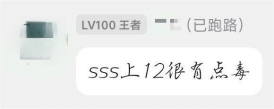

这是我们公会垫卡最强那位说出来的。就是说大家不要上当。

### 7.少用降解剂，用多了肯定会亏。

某天晚上炸的太惨了，你可能会想着无论如何今晚也得有点收益，于是用降解剂， 或者交易场买不绑卡之类。你怕过了今晚，前面的就白炸了。其实过两个月再上 的结果也一样。慢慢攒资源，重新开始，才是当前状态下的最优解。

或者你这时候私信一下我也可以。大家都是萌新，别不好意思，大家都有伤心事。 538658351 这是小群群号。比如你冲动的时候群友给你拦下来。

---

## 七．通往明日的旅途

这部分我们讲的是退游。

书接上回“米苏的挽留 ”。只要你还有一丝“成功就留下来 ”的希望，或者你还打算卖号，都建议退游之战不要跨卡，不要大量用降解剂，毁号可能就不好卖了。 要不备齐副卡把最后一战打好，要不完完整整地离开。

有时候真的会出现炸得太伤，不得不退游。在太过伤心的时候，假如你还有别的 游戏，你就想着你本来就是属于另一个游戏的人，你先去别的游戏找回一点快乐， 也许就能把老鼠忘掉了。

相比之下，我玩的另一款游戏，[崩坏3](https://bh3.mihoyo.com/))，就更像个游戏的样子，而老鼠就像个草台班子。bug 多，乱封号，官方隔三差五脑抽一次。老鼠这游戏的质量真的不怎 么样，就算是14年老游戏，变成现在这样也只能是没认真做。

你还有回来的机会。把老鼠放在看不见的角落，一个月后正好是新的一期三岛， 也许我们还可以有一个新的开始。但如果真的该放手了，就不必如此了。

如果能重新找一个游戏，特别是那些质量比老鼠高得多的游戏，开始新的生活， 我也会为大家感到开心的。

---

## 八．后记

希望叶嘉思楠可以成为大家坚持下去的理由。

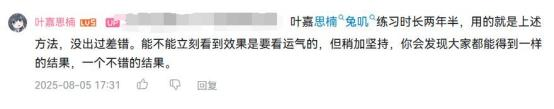

以前我还没成长起来的时候，我特别怕炸卡，因为我不了解这个游戏。现在我成 长了，但我又开始怕炸卡。因为我成功了，大家就愿意相信坚持下去是有意义的。 但如果我失败了，大家一定会想：“一个成功的例子也没有吗？难道结局终将不 美好？ ”那么，我还怎么劝大家坚持下去？

但大家放心，我不会倒下。我希望我能展现给大家一种奇特的游戏养成方式，就 像下面展示的这样。

- 1.8 版配图（2024.12.29）

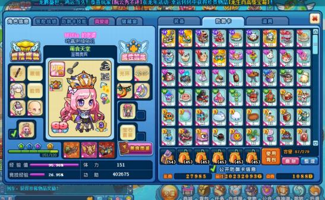

  

- 1.9 版配图（2025.5.31）

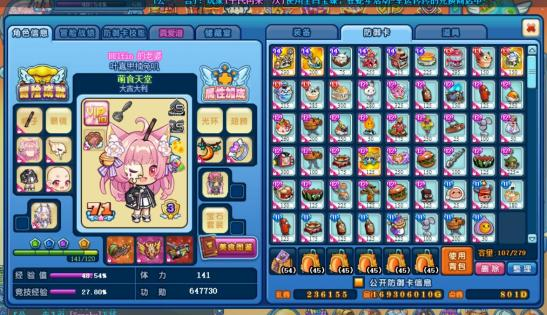

- 1.10 版配图（2025.8.29）

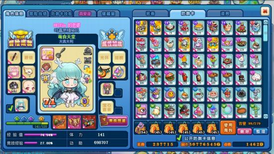

- 最近半年我的氪度主要是一期 100 档周氪和一百多次日氪一元，总花销约 200r。

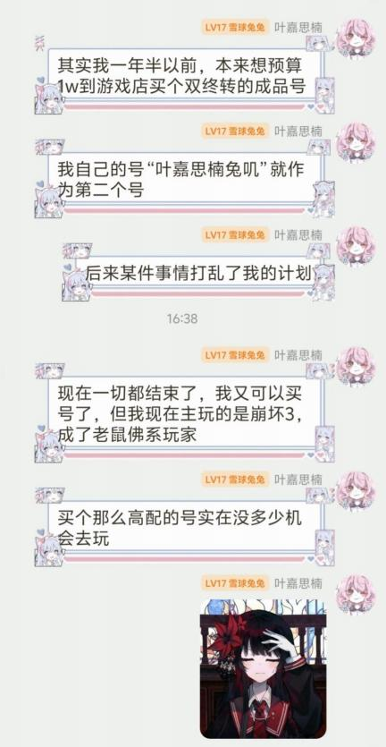
