# 叶嘉思楠兔叽の淋淋萌新小攻略1.10版 by deepseek

## 目录

[一．前言](#一．前言)  
[二．小萌新看这个](#二．小萌新看这个)  
[三．老萌新看这个](#三．老萌新看这个)  
[四．你离战胜合成屋只差这个](#四．你离战胜合成屋只差这个)  
[五．想和他们一样强还需这个](#五．想和他们一样强还需这个)  
[六．非常奇怪的小想法](#六．非常奇怪的小想法)  
[七．通往明日的旅途](#七．通往明日的旅途)  
[八．后记](#八．后记)  

---

## 一．前言

2025年8月29日。  
本可人儿是4399一服の叶嘉思楠兔叽，qq2774254339。  

很多姐妹说攻略太长惹，但素——谁让你全部看完的厚！想看合成屋上卡就直接跳第四部分，想学垫卡就去看第五部分，真素不听话惹～  

B站名：叶嘉思楠  

小攻略都出到1.10版了……为什么版本号这么多？因为第一版是两年前写的惹，每版主要内容都差不多，只是加亿点点细节罢惹。每次本可一有新的想法，就急着和大家分享，所以就出一个新版本噜～

---

## 二．小萌新看这个

### 1. 群号安利：
- 美食大战老鼠大群：485400068  
- 水天星河梦群：467607806  
- 一服小公会「萌食天堂」招新：538658351（六级公会+合成屋）  
- 叶嘉思楠の小群：529277902（欢迎来玩厚～）

### 2. 武器与卡片の淋语小点评：

**芥末海星刺身** ★★★★★（炭烧海星二转）：三岛12卡+威望就能做，天啦噜这是什么神仙机制，巅峰对决强到离谱！  

**樱桃反弹布丁** ★★★★★：一转之后连咖啡粉都不需要了，真素独立女性惹。  

**凉粉牛** ★☆：冷却10秒……本可等得花都谢了。  

**松塔爆破机** ★★★★（坚果爆炒机二转）：打玛门鼠？不如我们海星姐姐一根厚。  

**冰块冷萃机** ★★★★★（二转）：搭配莓果点心、精灵龙、宴飨女神四转，尊的绝配！建议前排放海星清兵，让冷萃机专心输出boss～  

**糖葫芦炮弹** ★★★★：有冷萃机的话可以不练噜，防空喵不转伤害都接近二转糖葫芦，交易场捡一个也行。  

**小火炉** ★★★★★：开局没了也别急，魔塔蛋糕秘宝窟刷一刷，还能抢救一下～没有产火卡的话它就是你永远的家。  

**极寒冰沙** ★★★★★ + **幻幻鸡** ★★★★★：两个一起上，效果更仙惹。  

**梦幻多拿滋** ★★★：萌新前期真神，但有海星之后可以say goodbye了。防空？爱心便当贵的时候拿来平替一下还行。  

**爱心便当** ★★★★☆：交易场可买，现在还能打电流鼠了，巅峰对策卡+1。  

**火箭猪** ★★★★☆：本体+技能书交易场，转职凭证等周氪出火箭猪+香料虎的那期再冲！  

**星星兔** ★★★★☆：二转启用。  
**守护神里格** ★★★★☆：终转启用。  
**战神阿瑞斯** ★★★☆、**爱神丘比特** ★★☆：三转配合转运能分解神谕之石。  

**烤蜥蜴投手** ★★★★、**振金投弹猪** ★★★★、**全能糖球投手** ★★★★：糖球表现更好，但子弹容易被后排吸引，真素敏感肌惹。  

**雷神索尔** ★★★★☆（三转）：周氪获取，中氪性价比之王罢了。  

**能量喵** ★★★★☆，冷却7秒，很贴心厚。  

**猪猪加强器**要不要进化成欧若拉？如果你氪不起技能和转职，高技能黑猪也很可以噜～  

**窃蛋龙** ★★★、**巨神尤弥尔** ★★★★☆（终转）：窃蛋龙推荐生肖宝珠换。  

**主神奥丁** ★★★★☆：直线射击，带穿透，尊的很会射惹。  

**火神洛基**：不转★★★☆（能量喵可替），三转★★★★★。  

**大地女神盖亚** ★★★★：终转启用，但技能氪度高，同氪度有更好的选择厚。  

**赤帝祝融** ★★★★、**冰神典伊** ★★★★：终转启用。  

**冰晶龙** ★★★★☆：比火箭猪强，但价格也更美。  

**查克拉兔** ★★★★☆：带穿透の海星，尊嘟假嘟？  

**花火龙** ★★★★★：生肖宝珠换，产火高冷却短，没必要转职，几万元扔转转都不出二转，本可人儿看了都摇头。  

**10周年烟花** ★★★★★、**微波炉爆弹** ★★★★、**金牛烟花** ★★★★★、**逗猫棒** ★★★★★：都是好东西惹～  

**瓜皮类**：只推荐带反伤的！一转瓜皮护罩★★★★☆技能书便宜，处女座★★★★☆，赫拉神使★★★★★略强于二转处女座。  

其它辅助：  
**麦芽糖** ★★★★★  
**深水炸弹** ★★★★★  
**油灯** ★★★★★  
**9周年幸运草扇** ★★★★★  

**终转宙斯** ★★★★☆：目前最强数值怪，价格也尊贵得很。  
**导弹蛇** ★★★★☆：几乎要二转16星才好用，但只有它的话还是有局限性的厚。  

新卡如法师蛇、幻影蛇……本可淡游太久，就不乱评价惹。

---

## 三．老萌新看这个

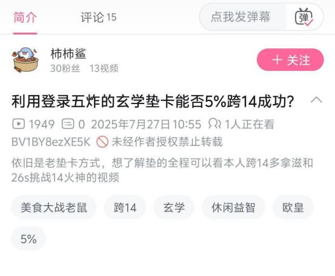  
本可想问：你就确定你发现的真是规律？如果是幻觉，害人了怎么办？  
我b站视频已经锐评过噜～  

### 1. 新の小玩法（数学部分可跳过）

如果你不光玩，还喜欢研究——  
合成屋的概率是不是假的？觉得是就对了，因为这和我们日常经验完全吻合。  

但如果我们默认：**数学期望对这游戏很重要**，后面再细聊它到底多重要。  

国产AI问答软件已经有六七种了（豆包、通义、deepseek），纯数学问题可以丢给它们算～  

上卡概率53%，10000次成功6000次是不是小概率？二项分布、卡方检验都可以用，但你会发现不管成多少次都是小概率……所以云涛晓雾用软件测10000次尊的很靠谱厚！  

### 2. 重新认识合成屋

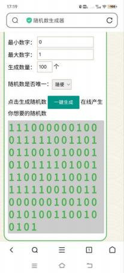
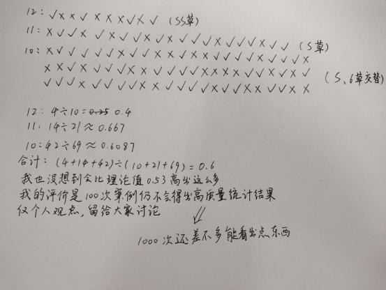

B站up云涛晓雾说合成屋很像真随机，本可非常同意。  

有人说高星卡容易炸？我不认可，高星低星概率没区别。  

真随机 vs 伪随机：  
- 真随机成本高，伪随机容易实现  
- 但合成屋大概率是伪随机，不过不影响你上卡  
- 你要做的是多关注生活中的美好，忘记不开心的事厚～  

如果你还是觉得合成屋成炸分布太离谱，可以去b站搜这两个视频：  
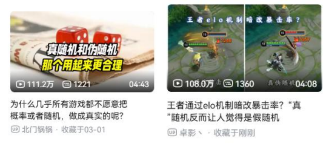

### 3. 当你不够好运时…

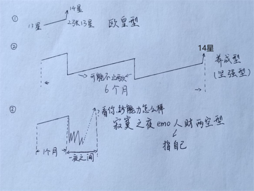
意思是：作为一个成熟的玩家，不要做第三种类型（放弃治疗）。  

玩老鼠是持久战，过程可能比你想象的还要长。  
痛苦的时候可以玩玩别的游戏，分散注意力。炸卡的晚上太抑郁了，玩点别的忘掉它～  

等你养成成功再回望，你会发现这段经历痛苦但值得。  
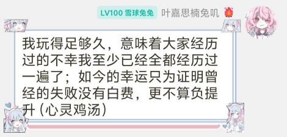  
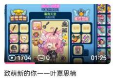
[我的b站视频](https://www.bilibili.com/video/BV1mUbGzuE3J/)

---

## 四．你离战胜合成屋只差这个

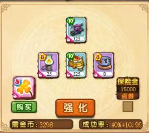  
“一大两小”の定式是常识，不懂的话很可能“捡了小的，丢了大的”惹。  

副卡组合比玄学还重要！路径甚至比运气还重要，很多老玩家都这么认为。

### 1. 加号概率详解

合成屋写40+10%，实际是50%。官方说明是40%强化+失败后10%再强化，但实测根本不是！  

80+20%理论上失败率16%，但实际几乎从不失败。  
40+10%理论成功46%，实测近50%。  

有人说遇到过80+20%失败……但每万次也只有极少数失败，和理论差远了，所以官方解释是错的厚！  

避免bug的方法：倒上加2草，还不保险就加3草，再失败就是恶性bug了，建议喊话官方：不修就退游噜！

### 2. 上卡路径（数学期望最优解）

**低星卡方案（通用）**：  
- 主3，副1或2，不加草  
- 主4，副3+1草  
- 主5，副4+2草  
- 主6，副5+3草 / 副5+4+3草  
- 主7，副6+4草 / 副6+5+4草  
- 主8，副8+5草 / 副8+6+5草  

四叶草多的话，最节约的方式是不带小卡。本可习惯开多余的4、5、6星卡包当小卡，没有就不带噜～

主7为什么副6而不是副7？  

| 目标星级  (n+1) | 主卡星级 (n) | n      | n-1   | n-2   |
| :------------- | :----------- | :----- | :---- | :---- |
| 1              | 0            | 100.00 | 88.00 | -     |
| 2              | 1            | 100.00 | 88.00 | -     |
| 3              | 2            | 96.83  | 79.20 | 60.83 |
| 4              | 3            | 68.58  | 55.00 | 42.92 |
| 5              | 4            | 49.50  | 40.33 | 24.17 |
| 6              | 5            | 39.58  | 33.00 | 20.08 |
| 7              | 6            | 31.92  | 26.40 | 13.20 |
| 8              | 7            | 26.42  | 21.20 | 10.60 |
| 9              | 8            | 22.00  | 13.20 | 6.00  |
| 10             | 9            | 13.50  | 4.50  | 2.20  |
| 11             | 10           | 12.50  | 4.60  | 1.80  |
| 12             | 11           | 11.60  | 4.30  | 1.70  |
| 13             | 12           | 10.70  | 3.98  | 1.56  |
| 14             | 13           | 10.10  | 3.67  | 1.41  |
| 15             | 14           | 9.50   | 3.36  | 1.26  |

（表格显示跨卡效率更高惹）

**微氪方案**：  
- 主9：副9+7+7+6草 / 9+5草  
- 主10：副10+8+8+S/SS草  
- 主11：副11+9+9+SS/SSS草  
- 主12：副12+10+10+SSS/SSR草  
- 主13：副13+11+11+SSR/蛇草  
- 主14：副14+12+12+SSR/蛇草  

免费SSR可以用来上13，反正很多人也不打算上14～  

**中氪方案**：  
- 主13：副13+11+11+SSR（一般不保险）  
- 主14：副14+蛇草+保险  
- 主15：副15+蛇草+保险  

**高氪方案**：  
- 主9：副9+7+7+6草  
- 主10：副10+8+8+S草  
- 主11：副11+9+9+SS草  
- 主12：副12+10+10+SSS/SSR草  
- 主13：副13+SSR+保险  
- 主14：副14+蛇草+保险  
- 主15：副14+蛇草+保险（跨）

带小卡效率更高，心态也更稳～50%概率尊的很友好厚！  

上14要11星小卡花销大？但你要想13卡本身价值是11卡的多少倍～  
平时留几个11卡包备用，上14就不慌噜。不上就缓半个月，值得等待！

### 3. 卡片品质查询

大群发送`#卡片 老鼠夹子`可查品质差，`#卡片 多用老鼠夹子`可查转职后变好卡。  

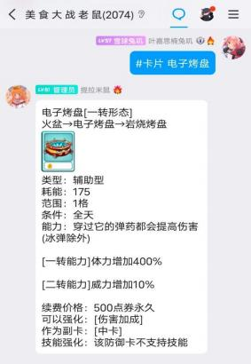  

本可的理解：  
**主卡 > 好卡（副卡） > 中卡 > 差卡**  
价值差很大，升星带来的提升也不同～  

不要给中差卡上高星！比如你有11星主卡、好卡、差卡各一张，先给差卡上12再倒给主卡？——亏麻了厚！  

没有“毒卡”这一说，运气差的时候换什么卡都炸。

### 4. 不同品质卡片价值对比

- 11好卡价值 ≈ 10好卡的4.3倍  
- 11差卡 ≈ 10好卡的3.3倍  
- 10差卡 ≈ 9好卡的3.3倍  

中卡推荐正上，效率比倒上高一点～  
差卡绝不推荐正上，只能倒上！  

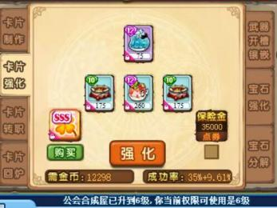

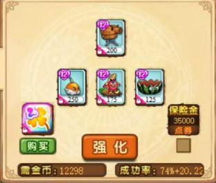
那种94%失败不是系统问题，只是非罢了惹～  

很多玩家上卡不是太冒险就是太奢侈，两种错误取平均就是正确，但很多人找不到～  

成与不成没人能控制，但亏与不亏、值与不值你能把握！数学期望很重要厚～

---

## 五．想和他们一样强还需这个

想学垫卡和大神一样强？包在我身上，不用再纠结垫卡失败差在哪啦！  
（垫卡可能根本不存在，可能根本没有用厚～）

垫卡概念2020年初才传播开，浅酌的视频让它普及，但他的方法还算朴素，后来的人越来越花里胡哨……只为播放量罢惹～  

直到2023年底，云涛晓雾的视频发布，“上卡必须垫卡”的禁忌一夜消失。  
  

合成屋概率造假？不太可能，因为造假带来的利益不如转转那样实在～  
不垫卡直接上卡曾经叫“莽”，现在本可重新定义：垫卡的反义词叫**正常上卡**。  

这些是我以前用但现在不用的方法：  
1. 感觉某些区人多就容易炸  
2. 垫十几次看分布，不合理就刷新重进  
3. 刷新游戏后直接上卡  

垫卡无用的第二个证据：如果“连炸区间”不存在，垫卡的意义是什么？  
那些所谓的成就，不垫卡也能遇到～  
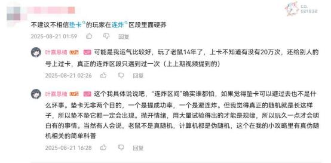

我不是不让大家垫卡，它没坏处，甚至能带来情绪价值。我朋友喜欢“骗保”玩法，视觉效果还是有的～  

视频文案：“我直说了垫卡无用。并不需要什么证据。所有玩家里到目前为止没有出现任何一个真正会垫卡的人，已经很说明问题了。”  

 
“什么？你说你会垫卡？那你就把工作辞了，靠接代上卡致富。你说你没把握？那你倒是证明了我的说法。”（不稳你垫了个寂寞吗？）

---

## 六．非常奇怪的小想法

这部分是奇怪小想法，有错误也别较真哦～  
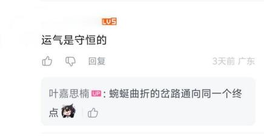

### 1. 运气不守恒？
已经赚的进口袋，已经亏的认栽，因为现在你面对的是新的开始。  
但长期来看，好像又有点守恒？连成连炸都只是概率期望的一部分，次数够多每个人都差不多。

### 2. 薛定谔的猫（打个比方）
如果你只有两张14卡，融一张给另一张上15，概率50%。  
结果出来前，它是成与炸的叠加态；结果出来后，坍缩为一种基态。  
所以之前就看值不值。微微氪上15接近毁号，但正常上卡没有上头一说，是一次宝贵的机会。

### 3. “成了就不亏”？
如果你总做趋向亏本的事，一段时间后你的号一定比别人短一截。  

“米苏的挽留”只是玩家一厢情愿，萌新别被老登忽悠了。  
有人用**跨卡**方式“胁迫”米苏挽留，侥幸成功还发心得忽悠萌新，真素让人反感厚～  
米苏没有思想，不然只会说：“你倒是退啊？”  

### 4. 不好的上卡习惯
损失从低星一路指数叠加。每次损失10%，八星到14星几乎浪费一半。  
对心态的摧残更严重，只要存在5%的浪费，就已经是灾难性的了。

### 5. 反直觉的结论
有的结论正因为反直觉，所以发现困难，不然早就人人皆知了。  
萌新拿十几次案例试图说服我，但老玩家一眼就能看出不对。真正的规律，少于两百次试验往往得不出结论。

### 6. 常见误解
- “毒卡”（某卡上12失败三次就是毒卡）  
- “毒概率”（30%好，32%毒，33%、34%好，40%毒）  
- “概率越高，概率越低”  
这些都是瞎扯淡～  

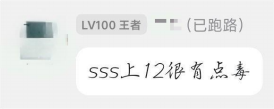  
这是我们公会垫卡最强那位说的，大家不要上当厚！

### 7. 少用降解剂
用多了肯定会亏。  
某晚炸太惨，你可能想今晚必须有点收益，于是用降解剂或买不绑卡……但过两个月再上结果也一样。慢慢攒资源重新开始才是最优解。  
或者私信我也可以，538658351这是小群群号。冲动时群友给你拦下来～

---

## 七．通往明日的旅途

这部分讲退游。  

只要你还有一丝“成功就留下来”的希望，或打算卖号，都建议退游之战不要跨卡，不要大量用降解剂，毁号可能不好卖。  
备齐副卡打好最后一战，或完完整整地离开。  

炸得太伤不得不退游？如果你还有别的游戏，就先去找回快乐，把老鼠忘掉～  
相比之下，[崩坏3](https://bh3.mihoyo.com/)更像个游戏，老鼠像草台班子。bug多，乱封号，官方隔三差五脑抽。  

你还有回来的机会。把老鼠放角落，一个月后是新一期三岛，也许能有新的开始。  
但如果该放手了，就不必如此。  
重新找一个质量更高的游戏开始新生活，本可也会为大家开心～

---

## 八．后记

希望叶嘉思楠可以成为大家坚持下去的理由。  

以前我怕炸卡，因为我不了解游戏；现在我怕炸卡，因为我成功了大家才相信坚持有意义。如果我也失败了，大家会想：“一个成功的例子也没有吗？”  
但大家放心，我不会倒下。我想展现一种奇特的游戏养成方式：  

- 1.8版配图（2024.12.29）  
  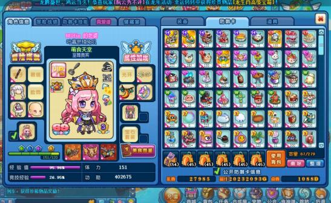  
- 1.9版配图（2025.5.31）  
  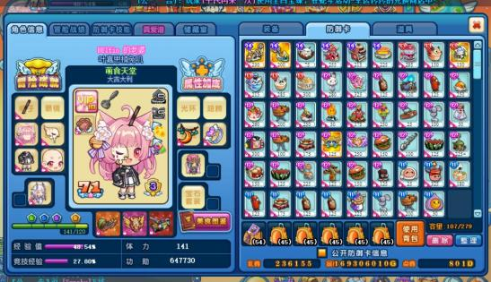  
- 1.10版配图（2025.8.29）  
  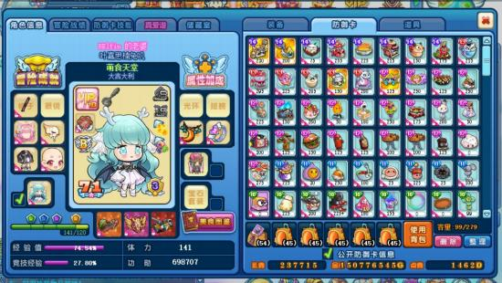  

最近半年我的氪度：一期100档周氪 + 一百多次日氪一元，总花销约200r。  

